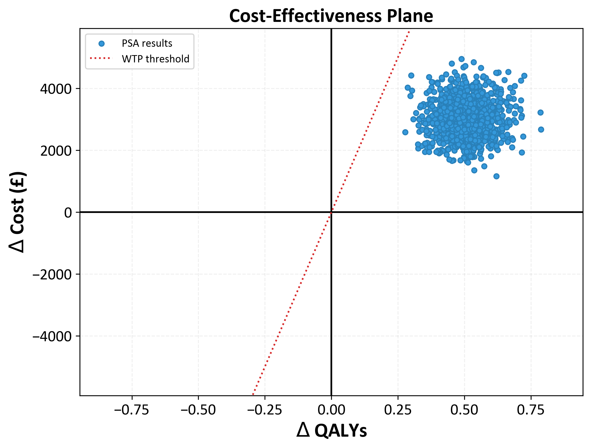

# Health Economic Analysis: Cost-Effectiveness Analysis (CEA)

This script performs a Cost-Effectiveness Analysis (CEA) of two health interventions, including a Probabilistic Sensitivity Analysis (PSA) and Jackknife Confidence Interval estimation. The script uses a default NICE willingness to pay threshold of £20,000 (adjustable) and applies a default NICE discount rate of 3.5% (also adjustable).

## Features
- Total cost and QALY calculations.
- Incremental Cost-Effectiveness Ratio (ICER) calculation.
- Probabilistic Sensitivity Analysis (PSA) with visualizations.
- Jackknife method for estimating 95% confidence intervals for the ICER.

