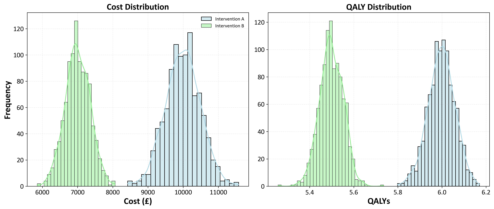
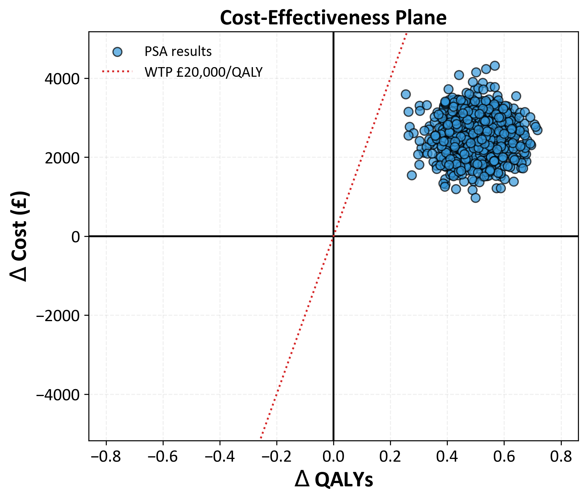

# Health Economic Analysis: Cost-Effectiveness Analysis (CEA)






This script performs a Cost-Effectiveness Analysis (CEA) of two health interventions, including a Probabilistic Sensitivity Analysis (PSA) and Jackknife Confidence Interval estimation.

## Features
- Total cost and QALY calculations.
- Incremental Cost-Effectiveness Ratio (ICER) calculation.
- Probabilistic Sensitivity Analysis (PSA) with visualizations.
- Jackknife method for estimating 95% confidence intervals for the ICER.

## Requirements
- Python 3.x
- Pandas
- Numpy
- Seaborn
- Matplotlib

## Usage
```bash
python cost_effectiveness_analysis_PSA.py
